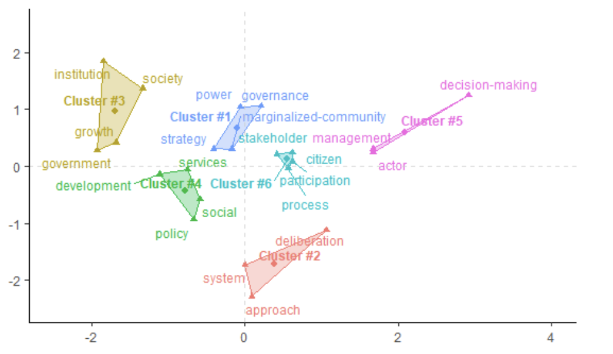

**Status:** In preparation  
**Book:** *Research Handbook on Inclusive Governance*, Edward Elgar Publishing

**Author:** Graham Ambrose

---

## Introduction

Literature engaging variably defined forms of governance—such as collaborative, polycentric, and cross-sector initiatives—is not devoid of discussions on inclusion. Yet inclusion itself is often vaguely defined and assumed as an outcome whenever these forms of governance are employed. Thus, we are left with an important question: what is inclusive governance? More specifically, when governance is variously defined, how do different academic traditions within Public Affairs (PA) literature frame and discuss inclusion?
This chapter aims to situate inclusive governance within the literature of public affairs subfields. I first define the different uses of ‘governance’ across PA domains, then review and analyze how inclusive governance is conceptualized, systematically examining 151 articles and book chapters through text mining and computational analysis to identify common themes. In doing so, I explore the overlaps and boundaries that emerge when conceptualizing inclusive governance across PA subfields. Ultimately, I argue that the varied ‘facets’ of inclusion found in scholarship do not signal a weak concept, but instead reflect the differing emphases on ‘governance’ across sub-disciplines.

---

## Results

The Correspondence Analysis revealed six distinct usage clusters, shown in Figure 2 as a visual representation in Euclidean space. Words sharing the same color and polygon belong to the same cluster, while those positioned closer together indicate more overlapping usage. For example, system and approach both appear in cluster #2, yet approach—within the analyzed corpus—shows greater direct (same paper) or indirect (across linked papers) overlap with policy than with decision-making, which fall into clusters #4 and #5, respectively.
While the chapter leverages a qualitative interpretation of these clusters, it is worth noting that the main uses of inclusion in these governance papers—represented in Figure 2—closely align with the key concepts and variable definitions of governance identified in the chapter’s literature review. This alignment strengthens confidence in the text extraction and Correspondence Analysis, as the findings emphasize a core governance question: inclusive of what? (e.g., inclusive policy, inclusive governance, inclusive decision-making, inclusion of citizens, etc.).

<b>Figure 2. Clustering of Related Contexts in which ‘Inclusion’ is Used</b>

<b>Figure 3. Articles that Most Contributed to the Clusters’ Identification</b>

Figure 3 maps, within the same Euclidean space, the key articles that contributed most to identifying each cluster. The numbers in the figure correspond to the specific papers listed in Table 2. For each cluster, selected quotations from these papers are presented in the chapter to illustrate and discuss how inclusion is used in context.

<b>Table 2. Most Contributed Articles by Cluster</b>

| ID | Cluster #1 | Cluster #2 | Cluster #3 | Cluster #4 | Cluster #5 | Cluster #6 |
|:--:|:-----------|:-----------|:-----------|:-----------|:-----------|:-----------|
| 1 | Carboni et al. (2017) | Chung (2011) | O'Connor et al. (2024) | Holland et al. (2012) | Scott and Thomas (2017) | Chu et al. (2016) |
| 2 | Martinez-Palacios (2017) | Hofstad et al. (2021) | Johnson et al. (2023) | Etherington and Ingold (2012) | Lenz (2024) | Greer (2001) |
| 3 | Bassoli (2010) | Carstensen et al. (2023) | Boerzel and Risse (2016) | Carson and Kerr (2010) | Van Buuren (2009) | Sant’anna et al. (2019) |

---

