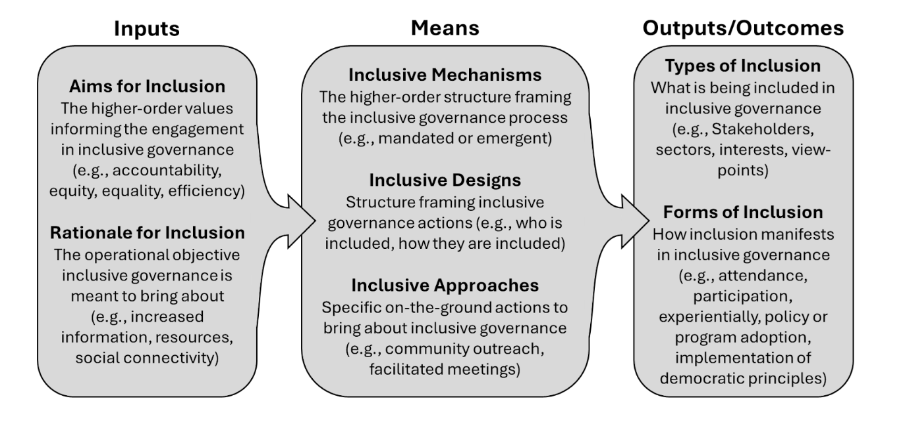

**Status:** In preparation  
**Book:** *Research Handbook on Inclusive Governance*, Edward Elgar Publishing

**Authors:** Graham Ambrose, <u>N. Blau</u>, Saba Siddiki  
*(Underline denotes advisee.)*

---

## An Overarching Introduction
The goal of this book is not to provide a definitive definition of inclusive governance, but to frame our discussion and justify its academic and practical importance. We aim to offer a structure for discussing the inputs that frame, the means that enable, and the outputs or outcomes that evaluate inclusive governance. This structure, along with definitions and examples, is outlined in Figure 1.1. While Figure 1.1 separates three categorical bins, we acknowledge that in practice these categories are closely intertwined. For instance, the desire to form an inclusive governance venue may stem from an input of equality (aim), which informs inclusive means in deciding who is included (i.e., design), which in turn informs output evaluations of stakeholders’ (i.e., types) attendance and participation (i.e., forms) throughout the process.

There is no one right way to inform, bring about, and evaluate inclusive governance. Across contexts, different inputs may be emphasized, creating tradeoffs with others, and certain governance means may better achieve specific outputs or outcomes. Still, some core characteristics of inclusive governance must be considered. Moreover, inclusive governance—across its diverse frames—is not purely academic; it is also a student- and practitioner-oriented practice. 

---

<b>Figures 1.1 Definitions across the Inputs, Means, and Outputs/Outcomes of Inclusive Governance</b>

---

## Three Themes of Inclusive Governance Across Chapters 
Across each of the chapters in this Handbook, the authors highlight three themes of inclusive governance within their specific context. As discussed above, there is no single definitive takeaway across all chapters, but rather, the application and practice of inclusive governance  reflects the specific case and its context.

1. What is being included and what are the tradeoffs of this focus? 
2. What means of inclusive governance are being used and are these means bringing about the desired effect? 
3. What are the key takeaways and reflections for students and practitioners derived from the cases? 

---

